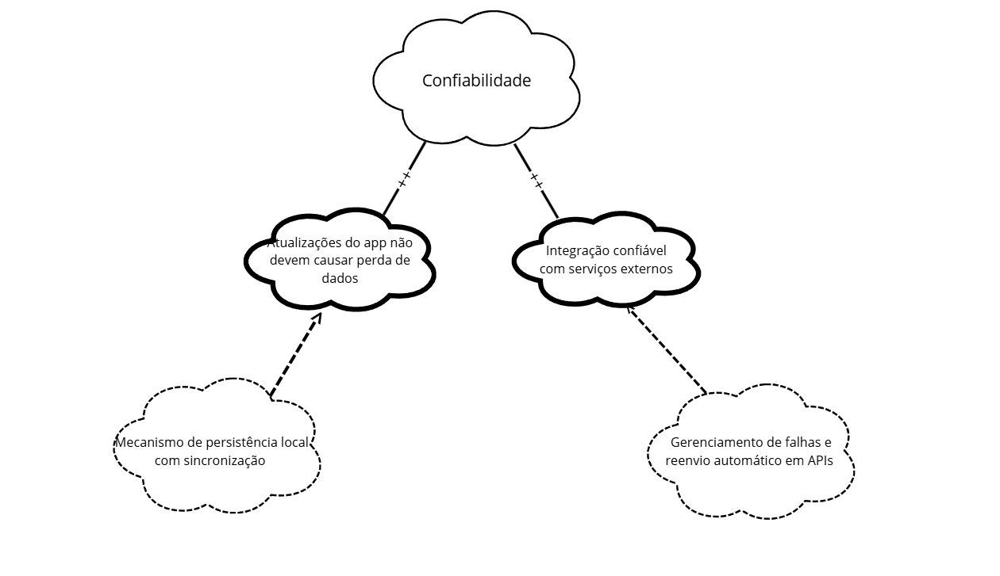
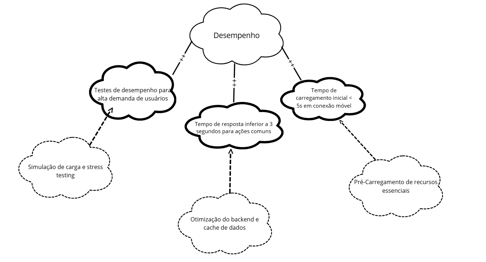
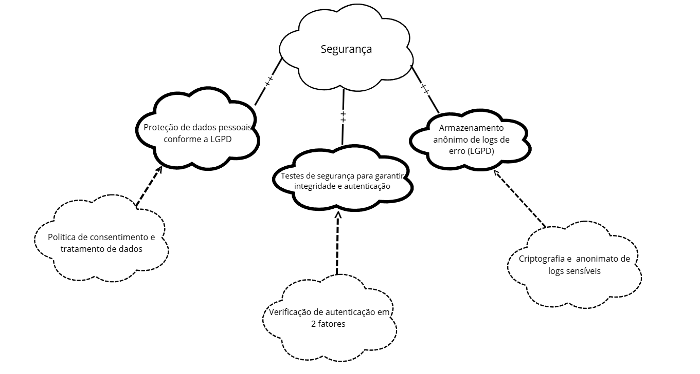
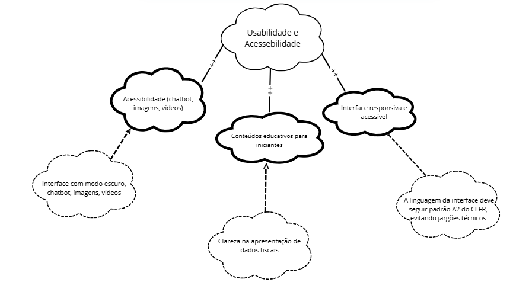

# NFR Framework

## Introdução

De acordo com a abordagem apresentada por **Reinaldo Antônio da Silva (2019)**, o NFR Framework é um modelo utilizado na modelagem de Requisitos Não-Funcionais (RNFs), baseado em *softgoals*. Esses objetivos não possuem uma definição clara ou critérios de sucesso bem estabelecidos, o que os torna ideais para representar qualidades subjetivas dos sistemas.

Os *softgoals* ajudam desenvolvedores a tomar decisões durante o projeto, considerando aspectos como qualidade, segurança e desempenho. Além disso, podem influenciar uns aos outros, criando uma rede de impactos que afetam o sistema como um todo.

## Tabela de contribuição 

|Nome                                               | Contribuição                      | 
| ------------------------------------------------- | --------------------------------- |
| [Thales Germano](https://github.com/thalesgvl)       | Criação do documento, ajustes   Adição do cartão 03 e 04   Revisor. |
| [Jose Eduardo](https://github.com/jevprado)       | Adição das imagens de referência e tópicos decomposição e contribuição, criação dos tópicos confiabilidade, desempenho, segurança, usabilidade e acessibilidade, adição do cartão 01 e 02, validação do cartão 01 e 02 e Adição dos SIG com imagens (figuras 02, 03 e 04).   Revisor. |
| [Diassis](https://github.com/Diaxiz)    | Adição do cartão 03 e 04   Validação do cartão 03 e 04 com usuário   Revisor  |
| [João Pedro](https://github.com/JpRodrigues2)     | Adição do cartão 09 e 10 |
| [Julia Massuda](https://github.com/JuliaReis18)     | Adição do cartão 07 e 08 |
| [Marco Marques](https://github.com/marcomarquesdc)     | Adição do cartão 11 e 12   Revisor |

Fonte: [Jose Eduardo](https://github.com/jevprado), 2025.

### Tipos de Softgoals

Os *softgoals* podem ser classificados em três grupos principais: 

1. **Softgoals NFR**: Representam diretamente os Requisitos Não-Funcionais e podem ser organizados de forma hierárquica.
2. **Softgoals de Operacionalização**: Apontam para alternativas de implementação dos softgoals NFR, por meio de funções, estruturas ou restrições.
3. **Softgoals de Afirmação**: Representam justificativas baseadas em conhecimento de domínio ou prioridades, servindo como base para apoiar ou refutar decisões de projeto e seleção de alternativas.

<b>Figura 1</b> - Tipos de Softgoal 

Fonte: Silva, 2019.

O atendimento aos *softgoals* é avaliado qualitativamente por meio de rótulos como **satisfeito**, **parcialmente satisfeito** ou **não satisfeito**, com base nas contribuições positivas ou negativas entre os nós no **Softgoal Interdependency Graph (SIG)**.

> **Nota**: O *Softgoal Interdependency Graph (SIG)* é um grafo que mostra como diferentes objetivos não-funcionais estão inter-relacionados, ajudando a visualizar conflitos e sinergias entre eles.

## Interdependências entre Softgoals

As **interdependências** representam as associações existentes entre os softgoals no NFR Framework. Elas se dividem em dois grandes grupos: **decomposições** e **contribuições**.

### Decomposições

As **decomposições** ocorrem em diferentes níveis de abstração, incluindo softgoals de NFR (requisitos não funcionais), de operacionalização e de afirmação. De acordo com Silva (2019), as três primeiras categorias envolvem a subdivisão de um softgoal em metas mais específicas, facilitando seu entendimento e análise. Há ainda uma decomposição especial voltada à priorização.

Os principais tipos de decomposição são:

- **Decomposição NFR:** utilizada para quebrar metas amplas e complexas em partes menores e mais manejáveis. Essa divisão ajuda a reduzir ambiguidades e a facilitar a definição de prioridades.

- **Decomposição de Operacionalização:** visa transformar uma solução genérica em soluções específicas, mais diretamente implementáveis no sistema.

- **Decomposição de Afirmação:** empregada para justificar ou refutar determinadas escolhas de projeto com base em argumentos técnicos ou estratégicos.

- **Decomposição de Priorização:** trata-se de uma decomposição especial em que um softgoal é refinado em outro do mesmo tipo e tópico, mas com a adição de um critério de prioridade. Essa abordagem permite destacar a relevância relativa de diferentes metas.

Essas decomposições são representadas graficamente nos modelos do NFR Framework por meio de conexões entre nós (softgoals), utilizando-se setas e operadores lógicos (como AND/OR) para indicar a natureza da decomposição.

<b>Figura 2</b> - Tipos de decomposição 

Fonte: Silva, 2019.

### Contribuições

No NFR Framework, os softgoals são progressivamente refinados em metas mais específicas. Como resultado, um softgoal derivado pode contribuir de forma total ou parcial — e tanto positiva quanto negativamente — para o softgoal original. A seguir, listam-se os tipos de contribuição:

- AND: se os softgoals derivados forem satisfeitos, o softgoal primordial também será.
- OR: se algum dos softgoals derivados forem satisfeitos, o softgoal primordial também será.
- MAKE(++): um softgoal originado contribui de forma plenamente positiva, logo o softgoal original também será satisfeito.
- BREAK(--): um softgoal originado contribui de forma plenamente negativa, logo o softgoal original será negado.
- HELP(+): um softgoal originado realiza uma contribuição restritamente positiva, o que reflete da mesma forma e na mesma intensidade no softgoal primordial.
- HURT(-): um softgoal originado realiza uma contribuição restritamente negativa, o que reflete da mesma forma e na mesma intensidade no softgoal primordial.
- UNKNOWN(?): contribuição incógnita.
- EQUALS: relação direta entre as satisfações do softgoal derivado e a do primordial.
- SOME: a forma de contribuição é conhecida, no entanto, a intensidade dessa contribuição é desconhecida.

---
### Propagação de impactos 

A **propagação de impactos** no NFR Framework diz respeito à análise das relações de dependência entre os requisitos não funcionais, avaliando como alterações em um softgoal podem influenciar outros com os quais mantém algum tipo de vínculo. Essa avaliação é essencial para identificar **efeitos colaterais**, **conflitos** e **contribuições acumuladas** que podem afetar diretamente a qualidade geral do sistema.

Para que essa análise seja eficaz, é necessário compreender com clareza:
- As **interações entre os softgoals**;
- As **prioridades atribuídas a cada meta de qualidade**;
- Os **possíveis trade-offs** entre requisitos concorrentes.

Ao considerar a propagação de impactos, os engenheiros de requisitos conseguem tomar **decisões mais conscientes**, identificar **pontos críticos do sistema** e **gerenciar mudanças** de forma mais segura e estruturada.

**Tipos de Impacto entre Softgoals**

A seguir, são apresentados os tipos mais comuns de impacto entre softgoals, junto com suas respectivas notações simbólicas, conforme utilizados no NFR Framework:

- **✓ (Satisfeito)**
  Indica que um requisito não funcional contribui de forma clara e significativa para a satisfação de outro softgoal. Representa uma relação de impacto **fortemente positiva**.

- **𝒲+ (Fracamente satisfeito)**
  Indica uma contribuição positiva, porém **moderada**. O requisito relacionado apoia o softgoal-alvo, mas sua influência é limitada ou indireta.

- **✗ (Negado)**
  Indica que o requisito em questão tem um impacto **negativo direto**, impedindo ou contradizendo a realização de outro softgoal.

- **𝒲− (Fracamente negado)**  
  Representa uma **influência negativa mais fraca**, que pode dificultar, mas não necessariamente inviabilizar, o alcance do softgoal afetado.

- **🗲 (Conflitante)** 
  Indica a existência de um **conflito** entre softgoals. A realização de um pode beneficiar alguns aspectos e prejudicar outros, exigindo negociação e priorização.

- **? (Indeterminado)**
  Utilizado quando a relação entre dois requisitos não funcionais é **desconhecida ou incerta**. Pode indicar falta de informação ou necessidade de análise posterior.

## Metodologia

A metodologia adotada nesta aplicação do NFR Framework seguiu uma abordagem prática e colaborativa, baseada nos princípios de **Reinaldo Antônio da Silva (2019)**, com foco na coleta, organização e análise de requisitos não funcionais relacionados ao sistema da Receita Federal.

Cada integrante do grupo foi responsável por duas funcionalidades específicas do sistema, sendo também responsável por levantar e modelar os requisitos não funcionais associados à sua área. Os RNFs foram obtidos por meio de técnicas de elicitação, como introspecção e análise de documentos.

A Tabela 1 apresenta a distribuição das funcionalidades por integrante:

<b>Tabela 1</b> - Distribuição de funcionalidades por integrante

| Funcionalidade               | Integrante Responsável |
|-----------------------------|------------------------|
| [Funcionalidade A]          | [Nome 1]               |
| [Funcionalidade B]          | [Nome 2]               |
| ...                         | ...                    |
| [Funcionalidade N]          | [Nome N]               |

<b>Tabela 1</b> - Distribuição de funcionalidades por integrante

Com base nessa divisão, os requisitos não funcionais foram mapeados, classificados em softgoals e organizados em modelos gráficos segundo os conceitos do NFR Framework.

### Cartões de Especificação

Para facilitar o registro e o rastreamento das decisões de projeto, foram utilizados **Cartões de Especificação de Requisitos Não-Funcionais**, apresentados nas Tabelas 2 a N. Cada cartão contém os seguintes campos:

<b>Tabela 2</b> - Padrão dos cartões 

| Campo              | Descrição                                                                 |
|--------------------|---------------------------------------------------------------------------|
| Nº do Requisito    | Identificador único do requisito (ex: RNF01, RNF02...)                   |
| Descrição          | Texto explicativo sobre o que o requisito exige ou pretende garantir     |
| Classificação      | FURPS+    |
| Origem             | Fonte do requisito (ex: usuário, legislação, análise técnica)             |
| Justificativa      | Razão pela qual o requisito foi definido (ex: atender à LGPD)            |
|Critério de aceitação| Condições que devem ser atendidas para considerar o requisito cumprido                                                                       |
| Dependência        | Outros requisitos dos quais este depende ou se relaciona                 |
| Prioridade         | Nível de importância (Alta, Média ou Baixa)                              |
| Conflitos          | Possíveis requisitos com os quais este pode gerar conflito               |
| Histórias          | Histórias de usuário relacionadas ao requisito, se aplicável             |

### Cartão de Especificação – RNF01

<b>Tabela 3</b> - cartão 01 - RNF01

| Campo               | Descrição                                                                 |
|---------------------|---------------------------------------------------------------------------|
| Nº do Requisito     | RNF01                                                                     |
| Descrição           | Melhorias no chatbot, suporte a imagens descritivas e vídeos com legenda para garantir acessibilidade a usuários com deficiência visual ou auditiva. |
| Classificação       | Acessibilidade                                                              |
| Origem              |[ADC13](https://requisitos-de-software.github.io/2025.1-ReceitaFederal/elicitacao/analisededocumentos/)                                                                          |
| Justificativa       | Assegurar inclusão digital e garantir que o aplicativo seja utilizável por pessoas com deficiência, atendendo a critérios de acessibilidade universal. |
| Critério de aceitação | O chatbot deve oferecer respostas por voz, suporte a leitores de tela e apresentar conteúdos multimídia com descrição textual ou legendas automáticas. |
| Dependência         | RNF5 (Interface responsiva e acessível), RNF17 (Suporte a leitores de tela) |
| Prioridade          |                                                                           |
| Conflitos           | Pode impactar negativamente no desempenho do app em dispositivos mais simples (potencial conflito com RNF10 e RNF16). |
| Histórias           |                                                                           |

Fonte: [José Eduardo](https://github.com/jevprado), 2025.

### Cartão de Especificação – RNF02

<b>Tabela 4</b> - cartão 02 - RNF02

| Campo                | Descrição                                                                                      |
|----------------------|------------------------------------------------------------------------------------------------|
| Nº do Requisito      | RNF2                                                                                           |
| Descrição            | O sistema deve fornecer conteúdos educativos adequados para iniciantes no tema do aplicativo. |
| Classificação        | Usabilidade (Apoio à Aprendizagem)                                                             |
| Origem               | [ADC14](https://requisitos-de-software.github.io/2025.1-ReceitaFederal/elicitacao/analisededocumentos/)                                                                                              |
| Justificativa        | Facilitar a curva de aprendizado para novos usuários e aumentar o engajamento inicial.         |
| Critério de aceitação| Conteúdo acessível diretamente no app; linguagem simples; tutoriais básicos em texto ou vídeo.|
| Dependência          | Pode depender da estrutura de interface (RNF5) e acessibilidade de mídia (RNF1).               |
| Prioridade           |                                                                                                |
| Conflitos            | Pode gerar conflito com desempenho (RNF16), caso o conteúdo aumente o tempo de carregamento.   |
| Histórias            |                                                                                                |

Fonte: [José Eduardo](https://github.com/jevprado), 2025.

### Cartão de Especificação – RNF03

<b>Tabela 5</b> - cartão 04 - RNF03

| Campo              | Descrição                                                                 |
|--------------------|---------------------------------------------------------------------------|
| Nº do Requisito    | RNF 03
| Descrição          | Permitir acesso offline a serviços essenciais do app, como históricos de contribuições e guias DARF já geradas.                    |
| Classificação      |   Usabilidade        |
| Origem             | Uso do App em locais com dificuldade de acesso à internet estável e áreas rurais               |
| Justificativa      | Garantir que o usuário tenha acesso a informações fiscais básicas mesmo sem conexão, aumentando a autonomia em regiões remotas     |
| Critério de aceitação| O sistema deve funcionar corretamente em modo offline, exibindo dados previamente sincronizados. Deve indicar que está offline.     |
| Dependência          | Sincronização prévia dos dados com o servidor  |
| Prioridade           | A definir                                 |
| Conflitos            | Pode haver conflito com requisitos de segurança, como autenticação online obrigatória                                              |
| Histórias            | US-07                           |

Fonte: [Thales Germano](https://github.com/thalesgvl), 2025.

### Cartão de Especificação – RNF04

<b>Tabela 6</b> - cartão 04 - RNF04

| Campo              | Descrição                                                                 |
|--------------------|---------------------------------------------------------------------------|
| Nº do Requisito    | RNF 04             |
| Descrição          | O sistema deve oferecer comparativo automático entre declarações de IR de anos diferentes, destacando alterações relevantes.  |
| Classificação      | Funcionalidade / Usabilidade   |
| Origem             | Necessidade identificada em análise técnica    |
| Justificativa      | Facilitar a verificação de mudanças entre declarações, reduzindo erros e aumentando a transparência no preenchimento               |
| Critério de aceitação| O sistema deve listar lado a lado os valores por categoria e destacar visualmente diferenças entre os anos comparados       |
| Dependência          | Dados das declarações anteriores devem estar disponíveis no sistema                |
| Prioridade           | A definir       |
| Conflitos            | Pode afetar performance em dispositivos com baixo processamento ou com dados incompletos           |
| Histórias            | US-08     |

Fonte: [Thales Germano](https://github.com/thalesgvl), 2025.

### Cartão de Especificação – RNF05

<b>Tabela 14</b> - cartão 05 - RNF05

| Campo                 | Descrição                                                                                                                                                                                                                                   |
| --------------------- | ------------------------------------------------------------------------------------------------------------------------------------------------------------------------------------------------------------------------------------------- |
| Nº do Requisito       | RNF05                                                                                                                                                                                                                                       |
| Descrição             | A interface do aplicativo deve ser responsiva e acessível, adaptando-se a diferentes tamanhos de tela e compatível com tecnologias assistivas.                                                                                              |
| Classificação         | Usabilidade (FURPS+)                                                                                                                                                                                                                        |
| Origem                | [ADC18 – Análise de Documentos](https://requisitos-de-software.github.io/2025.1-ReceitaFederal/elicitacao/analisededocumentos/)                                                                                                             |
| Justificativa         | Garantir que o aplicativo funcione de forma eficiente e compreensível em diversos dispositivos, promovendo a inclusão digital.                                                                                                              |
| Critério de aceitação | - Layout adaptável para diferentes tamanhos de tela. - Compatibilidade com leitores de tela como TalkBack e VoiceOver. - Navegação por teclado e suporte a contraste de cores acessível. - Cumprimento das diretrizes WCAG 2.1. |
| Dependência           | RNF11 (Compatibilidade com telas 4.5" a 7"), RNF17 (Suporte a leitores de tela)                                                                                                                                                             |
| Prioridade            | Alta                                                                                                                                                                                                                                        |
| Conflitos             | Ajustes de layout podem impactar o tempo de desenvolvimento ou performance inicial                                                                                                                                                          |
| Histórias             | US-06, US-30                                                                                                                                                                                                                                |

Fonte: [Diassis](https://github.com/Diaxiz), 2025.

### Cartão de Especificação – RNF06

<b>Tabela 15</b> - cartão 06 - RNF06

| Campo                 | Descrição                                                                                                                                                                                                                                                                                                              |
| --------------------- | ---------------------------------------------------------------------------------------------------------------------------------------------------------------------------------------------------------------------------------------------------------------------------------------------------------------------- |
| Nº do Requisito       | RNF06                                                                                                                                                                                                                                                                                                                  |
| Descrição             | O aplicativo deve oferecer suporte ao modo escuro para reduzir o cansaço visual e economizar bateria em dispositivos compatíveis.                                                                                                                                                                                      |
| Classificação         | Usabilidade / Portabilidade                                                                                                                                                                                                                                                                                            |
| Origem                | [ADC23 – Análise de Documentos](https://requisitos-de-software.github.io/2025.1-ReceitaFederal/elicitacao/analisededocumentos/), [INT17 – Introspecção](https://requisitos-de-software.github.io/2025.1-ReceitaFederal/elicitacao/introspeccao/)                                                                       |
| Justificativa         | Melhorar a experiência do usuário em ambientes com pouca luz e atender preferências individuais e limitações visuais.                                                                                                                                                                                                  |
| Critério de aceitação | - O sistema deve permitir alternância entre modo claro e escuro. - O modo escuro deve aplicar-se à interface completa sem comprometer a legibilidade. - O usuário deve poder ativar/desativar pelo app ou seguir o tema do sistema operacional. - Testes de contraste e legibilidade devem ser realizados. |
| Dependência           | RNF05 (Interface responsiva), RNF12 (Padrão de linguagem acessível)                                                                                                                                                                                                                                                    |
| Prioridade            | Média                                                                                                                                                                                                                                                                                                                  |
| Conflitos             | Pode exigir ajustes adicionais em componentes visuais e ícones                                                                                                                                                                                                                                                         |
| Histórias             | US-27, US-29                                                                                                                                                                                                                                                                                                           |

Fonte: [Diassis](https://github.com/Diaxiz), 2025.

### Cartão de Especificação – RNF07

<b>Tabela 7</b> - cartão 07 - RNF07

| Campo              | Descrição                                                                 |
|--------------------|---------------------------------------------------------------------------|
| Nº do Requisito    | RNF 07                                                                    |
| Descrição          | Testes de segurança para garantir a integridade dos dados e autenticação segura |
| Classificação      | Segurança                                                                 |
| Origem             | Análise técnica e requisitos de compliance                               |
| Justificativa      | Garantir a proteção dos dados dos usuários e conformidade com padrões de segurança, incluindo LGPD e boas práticas de desenvolvimento |
| Critério de aceitação | - Implementação de testes automatizados de segurança - Validação de autenticação e autorização - Verificação de criptografia de dados sensíveis - Testes de penetração realizados com sucesso - Conformidade com padrões OWASP |
| Dependência        | RNF relacionados à arquitetura do sistema e gerenciamento de dados       |
| Prioridade         | Alta                                                                      |
| Conflitos          | Possível impacto na performance devido aos controles de segurança        |
| Histórias          | |

Fonte: [Júlia Massuda](https://github.com/JuliaReis18), 2025.

### Cartão de Especificação – RNF08

<b>Tabela 8</b> - cartão 08 - RNF08

| Campo              | Descrição                                                                 |
|--------------------|---------------------------------------------------------------------------|
| Nº do Requisito    | RNF 08                                                                    |
| Descrição          | Compatível com Android 8+ e iOS 14+                                      |
| Classificação      | Portabilidade                                                             |
| Origem             | Análise de mercado e requisitos técnicos                                 |
| Justificativa      | Garantir ampla compatibilidade com dispositivos móveis em uso no mercado, abrangendo aproximadamente 85% dos usuários ativos |
| Critério de aceitação | - Aplicação executando corretamente em Android 8.0 (API 26) ou superior - Aplicação executando corretamente em iOS 14.0 ou superior - Testes realizados em diferentes modelos de dispositivos - Interface responsiva em diferentes tamanhos de tela |
| Dependência        | Requisitos funcionais do aplicativo móvel                                |
| Prioridade         | Alta                                                                      |
| Conflitos          | Limitações de recursos em versões mais antigas podem restringir funcionalidades avançadas |
| Histórias          | |

Fonte: [Júlia Massuda](https://github.com/JuliaReis18), 2025.

### Cartão de Especificação – RNF09

<b>Tabela 11</b> - cartão 09 - RNF09

| Campo              | Descrição                                                                 |
|--------------------|---------------------------------------------------------------------------|
| Nº do Requisito    | RNF 09                                                                    |
| Descrição          | Testes de usabilidade semestrais com público 60+                         |
| Classificação      | Usabilidade                                                               |
| Origem             | Análise demográfica e requisitos de acessibilidade                       |
| Justificativa      | Garantir que o aplicativo seja acessível e intuitivo para usuários idosos, considerando que representam uma parcela significativa dos contribuintes |
| Critério de aceitação | - Realização de testes de usabilidade com grupos de usuários acima de 60 anos a cada 6 meses - Identificação e correção de barreiras de usabilidade específicas para este público - Taxa de conclusão de tarefas superior a 80% nos testes - Tempo médio de conclusão de tarefas dentro dos padrões aceitáveis - Feedback positivo de pelo menos 70% dos participantes |
| Dependência        | Interface do usuário implementada e funcionalidades principais disponíveis |
| Prioridade         | Média                                                                     |
| Conflitos          | Possível conflito com design moderno que pode não ser familiar ao público idoso |
| Histórias          |  |

Fonte: [João Pedro](https://github.com/JpRodrigues2), 2025.

### Cartão de Especificação – RNF 10

<b>Tabela 12</b> - cartão 10 - RNF10

| Campo              | Descrição                                                                 |
|--------------------|---------------------------------------------------------------------------|
| Nº do Requisito    | RNF 10                                                                    |
| Descrição          | O aplicativo deve ter tempo de resposta inferior a 3 segundos para ações comuns |
| Classificação      | Performance                                                               |
| Origem             | Requisitos de experiência do usuário e padrões de mercado               |
| Justificativa      | Garantir uma experiência fluida e satisfatória para o usuário, evitando abandono devido à lentidão do sistema |
| Critério de aceitação | - Tempo de resposta máximo de 3 segundos para operações comuns (login, consultas, navegação) - Tempo de carregamento inicial do aplicativo inferior a 5 segundos - Testes de performance realizados em diferentes dispositivos e conexões - Monitoramento contínuo dos tempos de resposta em produção - 95% das requisições devem atender ao critério de tempo |
| Dependência        | Arquitetura do sistema, infraestrutura de servidores e otimização de código |
| Prioridade         | Alta                                                                      |
| Conflitos          | Funcionalidades complexas podem exigir mais tempo de processamento       |
| Histórias          |  |

Fonte: [João Pedro](https://github.com/JpRodrigues2), 2025.

### Cartão de Especificação – RNF11

<b>Tabela 13</b> - cartão 11 - RNF11

| Campo               | Descrição                                                                 |
|---------------------|---------------------------------------------------------------------------|
| Nº do Requisito     | RNF11                                                                     |
| Descrição           | O aplicativo deve funcionar em smartphones com telas de 4.5" a 7" sem perda de usabilidade |
| Classificação       | Usabilidade (FURPS+)                                                      |
| Origem              | [INT10 – Introspecção](https://requisitos-de-software.github.io/2025.1-ReceitaFederal/elicitacao/introspeccao/) |
| Justificativa       | Garantir que o aplicativo seja utilizável na maioria dos dispositivos disponíveis no mercado brasileiro |
| Critério de aceitação | Aplicativo testado e validado em diferentes tamanhos de tela sem comprometimento da experiência do usuário |
| Dependência         | RNF5 (Interface responsiva e acessível)                                   |
| Prioridade          | Alta                                                                       |
| Conflitos           | RNF19 (Versão em HTML5 pode exigir adaptação adicional de layout)         |
| Histórias           |  |

Fonte: [Marco Marques](https://github.com/marcomarquesdc), 2025.

### Cartão de Especificação – RNF12

<b>Tabela 13</b> - cartão 11 - RNF11

| Campo               | Descrição                                                                 |
|---------------------|---------------------------------------------------------------------------|
| Nº do Requisito     | RNF12                                                                     |
| Descrição           | A linguagem da interface deve seguir padrão A2 do CEFR, evitando jargões técnicos |
| Classificação       | Usabilidade (FURPS+)                                                      |
| Origem              | [ADC25 – Análise de Documentos](https://requisitos-de-software.github.io/2025.1-ReceitaFederal/elicitacao/analisededocumentos/) |
| Justificativa       | Facilitar o uso do app por pessoas com menor escolaridade ou pouca familiaridade com termos técnicos |
| Critério de aceitação | Todo o conteúdo textual revisado com base em vocabulário controlado CEFR-A2 e testes com usuários reais |
| Dependência         | RNF2 (Conteúdo educativo para iniciantes)                                 |
| Prioridade          | Alta                                                                       |
| Conflitos           | Nenhum identificado                                                        |
| Histórias           |  |

Fonte: [Marco Marques](https://github.com/marcomarquesdc), 2025.

## NFR00: Geral

<b>Figura 2</b> - NFR01: Confiabilidade

Fonte: [Jose Eduardo](https://github.com/jevprado), 2025.

## NFR01: Confiabilidade

### Requisitos

- **RNF14** – Atualizações do app não devem causar perda de dados
- **RNF21** – Integração confiável com serviços externos

<b>Figura 2</b> - NFR01: Confiabilidade

Fonte: [Jose Eduardo](https://github.com/jevprado), 2025.

### Propagação de Impacto

| Código do Requisito | Propagação de Impacto |
| ------------------- | --------------------- |
| RNF14               | ✓                     |
| RNF21               | ✓                     |

## NFR02: Desempenho

### Requisitos

- **RNF03** – Testes de desempenho para alta demanda de usuários
- **RNF10** – Tempo de resposta inferior a 3 segundos para ações comuns
- **RNF15** – Tempo de carregamento inicial < 5s em conexão móvel

<b>Figura 3</b> - NFR02: Desempenho

Fonte: [Jose Eduardo](https://github.com/jevprado), 2025.

### Propagação de Impacto

| Código do Requisito | Propagação de Impacto |
| ------------------- | --------------------- |
| RNF3                | ✓                     |
| RNF10               | ✓                     |
| RNF15               | ✓                     |

## NFR03: Segurança

### Requisitos

- **RNF04** – Proteção de dados pessoais conforme a LGPD
- **RNF07** – Testes de segurança para garantir integridade e autenticação
- **RNF18** – Armazenamento anônimo de logs de erro (LGPD)

<b>Figura 3</b> - NFR02: Desempenho

Fonte: [Jose Eduardo](https://github.com/jevprado), 2025.

### Propagação de Impacto

| Código do Requisito | Propagação de Impacto |
| ------------------- | --------------------- |
| RNF4                | ✓                     |
| RNF7                | ✓                     |
| RNF18               | ✓                     |

## NFR04: Usabilidade e Acessibilidade 

### Requisitos

- **RNF01** – Acessibilidade (chatbot, imagens, vídeos)
- **RNF02** – Conteúdos educativos para iniciantes
- **RNF05** – Interface responsiva e acessível
- **RNF06** – Interface com modo escuro
- **RNF12** – A linguagem da interface deve seguir padrão A2 do CEFR, evitando jargões técnicos
- **RNF17** – Suporte a leitores de tela
- **RNF20** – Clareza na apresentação de dados fiscais
  

<b>Figura 3</b> - NFR03: Desempenho

Fonte: [Marco](https://github.com/marcomarquesdc), 2025.

### Propagação de Impacto

| Código do Requisito | Propagação de Impacto |
| ------------------- | --------------------- |
| RNF1                | 𝒲+                   |
| RNF2                | 𝒲+                   |
| RNF5                | ✓                     |
| RNF6                | 𝒲+                   |
| RNF12               | ✓                     |
| RNF17               | ✓                     |
| RNF20               | ✓                     |

## NFR05: Portabilidade

### Requisitos

- **RNF08** – Compatível com Android 8+ e iOS 14+
- **RNF11** – Funcionar em smartphones com telas de 4.5" a 7"
- **RNF13** - Modo de operação em baixa conectividade com cache essencial 
- **RNF19** - Versão mínima HTML5 responsiva para navegador

### Propagação de Impacto

| Código do Requisito | Propagação de Impacto |
| ------------------- | --------------------- |
| RNF8                | ✓                     |
| RNF11               | ✓                     |
| RNF13               | 𝒲+                   |
| RNF19               | 𝒲+                   |

## NFR06: SIG Completo

### Requisitos

- **Todos os anteriores** integrados no Sistema de Informação Gerencial

## Vídeos de validação 

### Validação do Cartão de Especificação – RNF01 e RNF02

<b>Vídeo 1</b> - Validação do Cartão de Especificação – RNF01 e RNF02

<iframe width="700" height="400"
        src="https://www.youtube.com/embed/0SdN0b9stFg"
        title="YouTube video player"
        frameborder="0"
        allow="accelerometer; autoplay; clipboard-write; encrypted-media; gyroscope; picture-in-picture; web-share"
        referrerpolicy="strict-origin-when-cross-origin"
        allowfullscreen>
</iframe>

Fonte: [Jose Eduardo](https://github.com/jevprado), 2025.

### Validação do Cartão de Especificação – RNF06 e RNF07

<b>Vídeo 2</b> - Validação do Cartão de Especificação – RNF06 e RNF07

<iframe width="700" height="400"
        src="https://www.youtube.com/embed/ZioPIqchkFI"
        title="YouTube video player"
        frameborder="0"
        allow="accelerometer; autoplay; clipboard-write; encrypted-media; gyroscope; picture-in-picture; web-share"
        referrerpolicy="strict-origin-when-cross-origin"
        allowfullscreen>
</iframe>

Fonte: [Diassis](https://github.com/Diaxiz), 2025.

## Referências
> <a>1.</a> SILVA, Reinaldo Antônio da. *NFR4ES: Um Catálogo de Requisitos Não-Funcionais para Sistemas Embarcados*. Recife: Universidade Federal de Pernambuco, 2019.
Disponível em: [https://aprender3.unb.br/pluginfile.php/3096155/mod\_resource/content/2/DISSERTA%C3%87%C3%83O%20Reinaldo%20Ant%C3%B4nio%20da%20Silva.pdf](https://aprender3.unb.br/pluginfile.php/3096155/mod_resource/content/2/DISSERTA%C3%87%C3%83O%20Reinaldo%20Ant%C3%B4nio%20da%20Silva.pdf)
>

## Histórico de Versão

| Versão | Data       | Descrição                          | Autor                                          | Revisor                                     |
| ------ | ---------- | ---------------------------------- | ---------------------------------------------- | ------------------------------------------- |
| `1.0`     | 29/05/2025 | Criação do documento NRF-framework | [Thales Germano](https://github.com/thalesgvl) | [Jose Eduardo](https://github.com/jevprado) |
| `1.1`    | 29/05/2025 | Ajustes no documento | [Thales Germano](https://github.com/thalesgvl) |[Jose Eduardo](https://github.com/jevprado)|
| `1.2`    | 01/06/2025 | Adicionando imagens e tópicos decomposição e contribuição | [Jose Eduardo](https://github.com/jevprado) | [Thales Germano](https://github.com/thalesgvl) |
| `1.3`    | 01/06/2025 | Adicionando cartões RNF 03/04/ | [Thales Germano](https://github.com/thalesgvl)   |  [Jose Eduardo](https://github.com/jevprado) | 
| `1.4`    | 01/06/2025 | Adicionando cartões RNF 01/02/ | [Jose Eduardo](https://github.com/jevprado)  | [Thales Germano](https://github.com/thalesgvl) | 
| `1.5`    | 01/06/2025 | Adicionando cartões RNF 11/12 | [Marco Marques](https://github.com/marcomarquesdc) | [Thales Germano](https://github.com/thalesgvl) | 
| `1.6`    | 01/06/2025 | Adicionando cartões RNF 07/08 | [Júlia Massuda](https://github.com/JuliaReis18) | [Jose Eduardo](https://github.com/jevprado)| 
| `1.7`    | 01/06/2025 | Adicionando cartões RNF 05/06 | [Diassis](https://github.com/Diaxiz) | [Jose Eduardo](https://github.com/jevprado)| 
| `1.8`    | 30/06/2025 | Adicionando validação dos cartões RNF 01/02 | [Jose Eduardo](https://github.com/jevprado) | [Diassis](https://github.com/Diaxiz)| 
| `1.9`    | 07/07/2025 | Adicionando os respectivos SIG (figuras, 02, 03 e 04) | [Jose Eduardo](https://github.com/jevprado) | [Marco Marques](https://github.com/marcomarquesdc) | 
| `1.10`    | 07/07/2025 | Adicionando vídeo de validação RNF06 e RNF07  | [Diassis](https://github.com/Diaxiz) | [Jose Eduardo](https://github.com/jevprado) | 