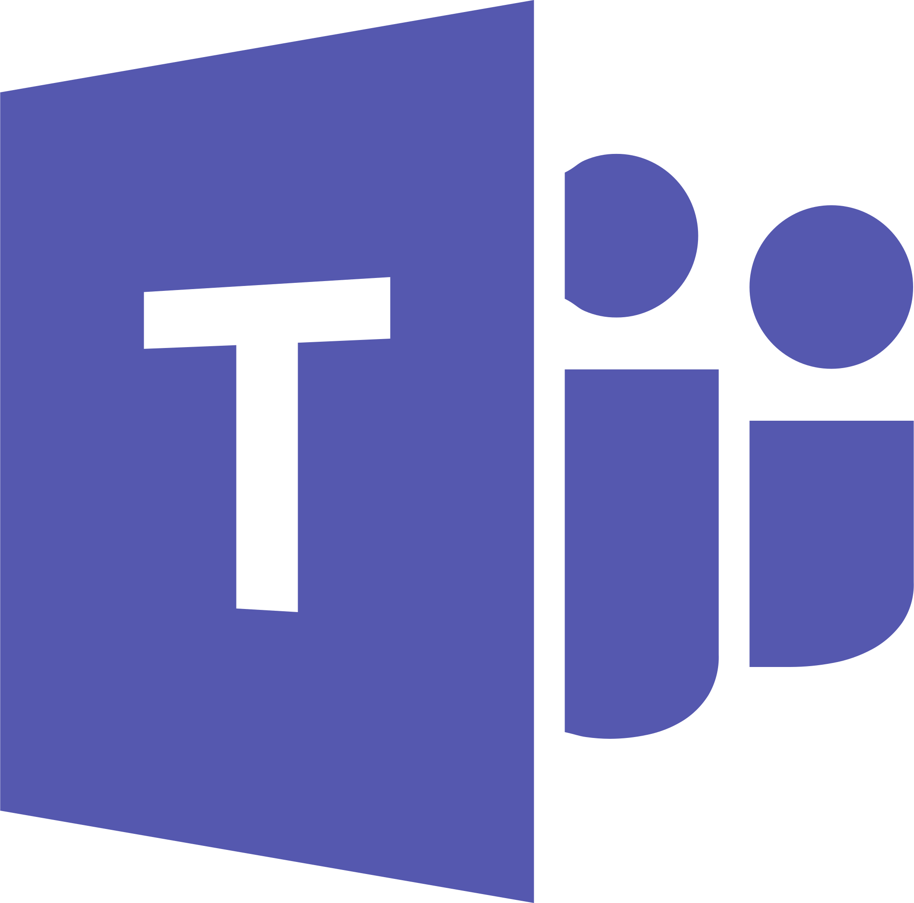

# Ferramentas

## Introdução

Para garantir um fluxo de trabalho eficiente, organizado e colaborativo, foi necessário empregar uma variedade de ferramentas ao longo do desenvolvimento do projeto. Na tabela a seguir, apresentamos as principais ferramentas adotadas, acompanhadas de suas respectivas finalidades dentro do contexto do projeto. Elas foram utilizadas para viabilizar desde o versionamento de código até a comunicação entre os membros da equipe, passando por produção de artefatos gráficos, edição de documentos, elaboração de diagramas e compartilhamento de conteúdo

## Ferramentas Utilizadas no projeto

<b>Tabela 1</b> - Ferramentas Utilizadas no Projeto

|                                                                                                                           |        Ferramenta         |                               Finalidade                               |
| :-----------------------------------------------------------------------------------------------------------------------: | :-----------------------: | :--------------------------------------------------------------------: |
|                                     |          GitHub  [1](#FRM1)         | Organizar, versionar e documentar artefatos produzidos para o projeto. |
|                                   |          MkDocs  [2](#FRM2)          | Criação das páginas de documentação.    |
|                                      |    Visual Studio Code   [3](#FRM3)  | Edição dos arquivos de documentação. |
|                 |           Teams     [4](#FRM4)      |Canal principal para reunioes e apresentacões do grupo. |
|                                |         WhatsApp       [5](#FRM5)   | Principal canal de comunicação do grupo.|
|                                  |          YouTube   [6](#FRM6)       | Hospedagem dos vídeos produzidos da disciplina. |
|                         |     Google Planilhas   [7](#FRM7)   | Criação de planilhas relacionadas a diversos tópicos do projeto.|
|                                |        Google Docs   [8](#FRM8)     | Criação de documentos relacionados a diversos tópicos do projeto.|
|                                |        Canva   [9](#FRM9)     | Utilizado para produção de auxílios visuais.|
|                                |        ChatGPT   [10](#FRM10)     | Utilizado para automações e auxilio de tarefas repetitivas.|
|                                |        This Person Does Not Exist  [11](#FRM11)     | Utilizado na geração de rostos que não existem para as personas.|

Fonte: [Jose Eduardo](https://github.com/jevprado), 2025.

## Referências Bibliograficas

> <a id="FRM1" href="#anchor_1">1.</a> GitHub. Disponível em: [https://docs.github.com/pt](). Acesso em: 12 de abr. de 2025.
>
> <a id="FRM2" href="#anchor_2">2.</a> Mkdocs. Disponível em: [https://www.mkdocs.org/](). Acesso em: 12 de abr. de 2025.
>
> <a id="FRM3" href="#anchor_3">3.</a> Visual Studio Code. Disponível em: [https://code.visualstudio.com/](). Acesso em: 12 de abr. de 2025.
>
> <a id="FRM4" href="#anchor_4">4.</a> Microsoft Teams. Disponível em: [https://www.microsoft.com/pt-br/microsoft-teams](). Acesso em: 12 de abr. de 2025.
>
> <a id="FRM5" href="#anchor_5">5.</a> WhatsApp. Disponível em: [https://www.whatsapp.com/?lang=pt_br](). Acesso em: 12 de abr. de 2025.
>
> <a id="FRM6" href="#anchor_6">6.</a> YouTube. Disponível em: [https://about.youtube/](). Acesso em: 12 de abr. de 2025.
>
> <a id="FRM7" href="#anchor_7">7.</a> Google Planilhas. Disponível em: [https://docs.google.com/spreadsheets](). Acesso em: 12 de abr. de 2025.
>
> <a id="FRM8" href="#anchor_8">8.</a> Google Documentos. Disponível em: [https://docs.google.com/document](). Acesso em: 12 de abr. de 2025.
>
> <a id="FRM9" href="#anchor_9">9.</a> Canva. Disponível em: [https://www.canva.com/](). Acesso em: 13 de abr. de 2025.
>
> <a id="FRM10" href="#anchor_10">10.</a> ChatGPT. Disponível em: [https://chat.openai.com/](). Acesso em: 21 de abr. de 2025.
>
> <a id="FRM11" href="#anchor_11">11.</a> This Person Does Not Exist. Disponível em: [https://this-person-does-not-exist.com/](). Acesso em: 21 de abr. de 2025.
>

## Histórico de versões

Versão |   Data  | Descrição | Autor(es) | Revisor(es)
------ | ---- | ------ | ---------- | ----------
`1.0` | 12/04/2025 | Criação do documento de ferramentas | [Jose Eduardo](https://github.com/jevprado) | [Thales Germano](https://github.com/thalesgvl) |
`1.1` | 13/04/2025 | Adição de ferramentas | [Jose Eduardo](https://github.com/jevprado) | [Thales Germano](https://github.com/thalesgvl) |
`1.2` | 21/04/2025 | Adição de novas ferramentas | [Jose Eduardo](https://github.com/jevprado) | [Thales Germano](https://github.com/thalesgvl) |
